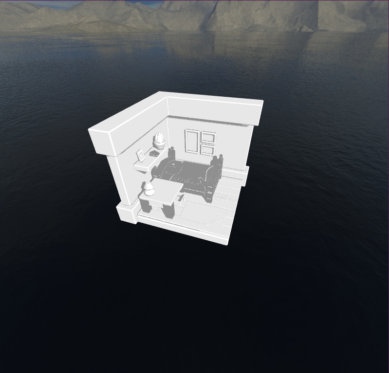

# GDEV 32 Finals
A compilation of LearnOpenGL stuff \
https://github.com/avsecam/GDEV32-Finals

## Setup
- Have Assimp compiled and its files in their respective folders
- Alternatively, run out.exe.

## Added Features to Programming Exercise 3
- Cubemaps (Skybox)
- Reflections
- PCF
- Assimp Model Loading

## Controls
- W / S to move camera up and down
- Right click to change scene
- Left click to toggle reflectivity
